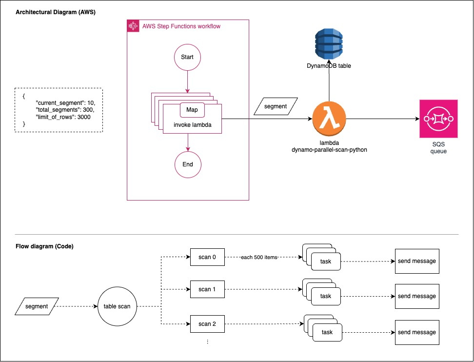

# DynamoDB Parallel Scan using Python
## dynamo-parallel-scan-python

Small project created to parallelyze a scan operation on a DynamoDB table. 

This code is meant to be used on a Lambda function. The handler input is an event with three main informations:

- the current segment;
- the total number of segments;
- row limit per segment.

JSON payload:
```
{
	"current_segment": 10,
	"total_segments": 300,
	"limit_of_rows": 3000
}
```

By using asynchronous operations the segment scan is parallelyzed. Each row retrieved is then transformed into an SQS event and posted on a queue.

## Solutions Architecture

The original solutions architecture for this solution is composed of 
- Step functions;
- Lambda;
- DynamoDB table;
- SQS.



## Local Testing

Necessary tools:

+ LocalStack - https://github.com/localstack/localstack.git
+ Docker - https://www.docker.com/
+ AWS CLI - https://aws.amazon.com/pt/cli/
+ Python3 - https://www.python.org/downloads/

* Tested on local stack.
[LocalStack configutation and use reference](https://alcantara-afonso.medium.com/localstack-aws-in-your-machine-and-for-free-its-a-dream-come-true-94437dc1c48)

Testing locally:
1) Follow the instructions on the link above to create a LocalStack container on Docker
2) Use the following command to create a DynamoDB table on LocalStack:
    ```
    aws --endpoint-url=http://localhost:4566 dynamodb create-table \
        --table-name TestTable \
        --attribute-definitions AttributeName=PK,AttributeType=S AttributeName=SK,AttributeType=S \
        --key-schema AttributeName=PK,KeyType=HASH AttributeName=SK,KeyType=RANGE \
        --provisioned-throughput ReadCapacityUnits=5,WriteCapacityUnits=5
    ```
3) Create a SQS queue on LocalStack:
    ```
        aws --endpoint-url=http://localhost:4566 sqs create-queue --queue-name parallel-scan-queue
    ```

4) Create a virtual environment for your python application by running the following commands:
    ```
        pip3 install virtualenv
        python3 -m venv .venv
        source .venv/bin/activate
    ```
5) Install python requirements for requirements.txt file:
    ```
        python3 -m pip install -r requirements.txt
    ```
6) Use the python script on 'localExec/databaseLoad/createTableRecords/TableRecordsProducerJSONImportFile.py' to populate the DynamoDB table:
    ```
        python3 /localExec/databaseLoad/LoadTable.py
    ```
7) Move the 'localExec/test_local.py' file to the 'app' folder
8) Change the parameters values on 'app/config.yaml' if needed
9) Use the python script moved to the app folder to run the scan:
    ```
        python3 /app/test_local.py
    ```


## Authors

*Giovanna Albuquerque* [@GHBAlbuquerque](https://github.com/GHBAlbuquerque)

Done in 2025
